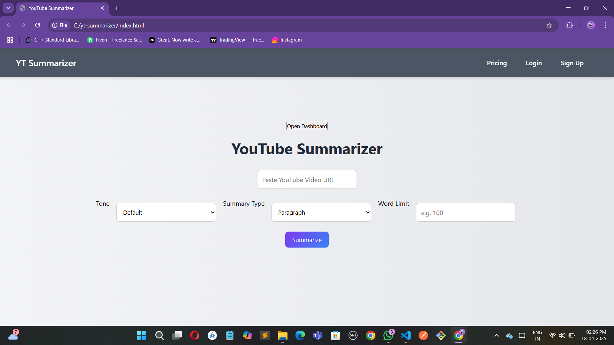
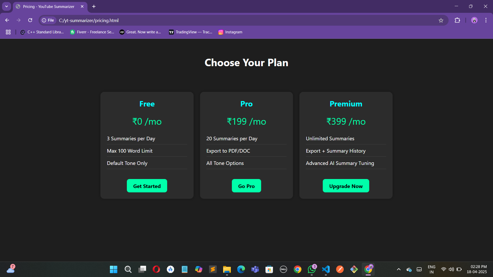
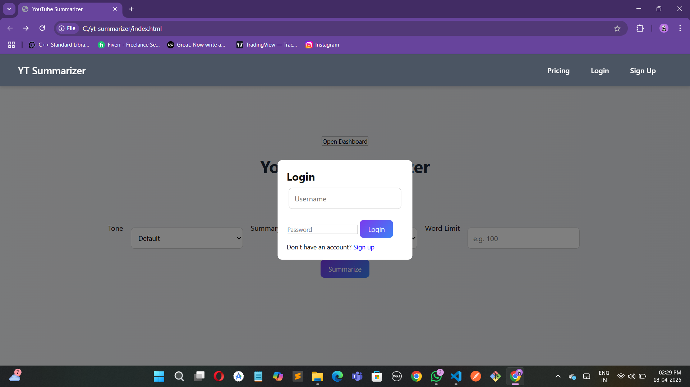
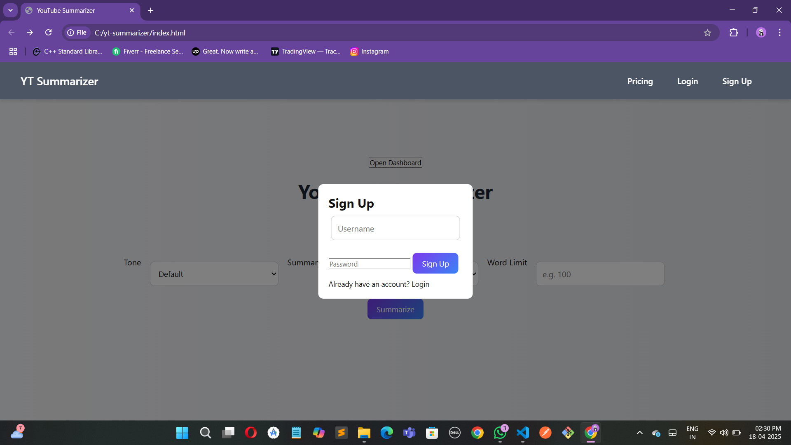
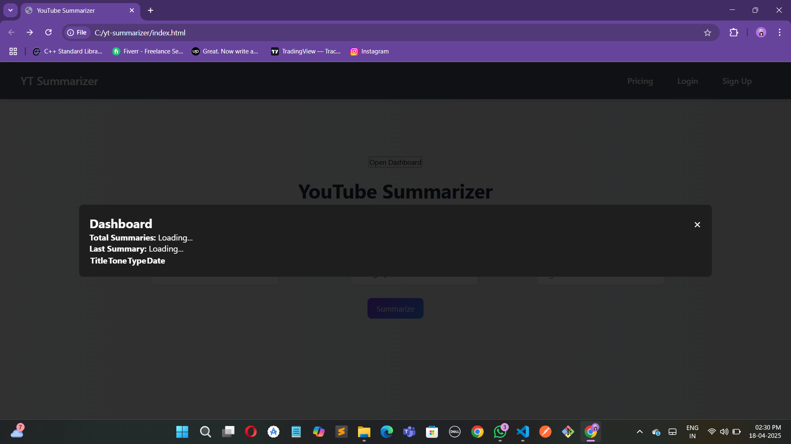
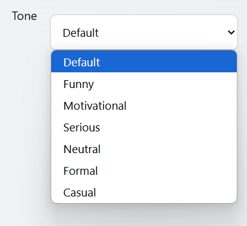
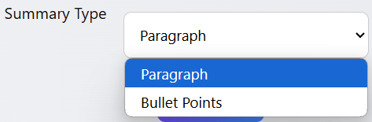
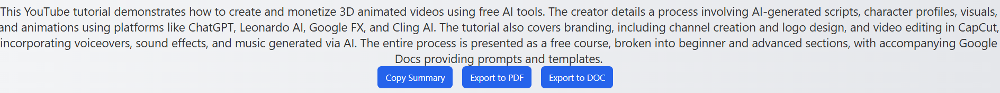

# YouTube Summariser AI

An advanced web app that summarizes any YouTube video into clean, structured text. Supports multiple subtitle languages, custom tones, word limits, and summary types. Built using FastAPI, Gemini API, and a clean frontend interface.

## Features

- *Summarize Any YouTube Video* using its subtitles.
- *Custom Tone* (default, Motivational, Serious, Formal, Casual, Funny)
- *Word Limit Selector* (Short, Medium, Long)
- *Summary Type* (Bullet, Paragraph)
- *Multilingual Subtitle Support*
- *Summary Export* to PDF/DOC
- *Copy to Clipboard* feature
- *Login/Signup* with summary history dashboard
- *Clean UI/UX* with responsive design

## Demo Video

[Watch Demo on YouTube](https://youtu.be/KT2Z2hBN0vk?si=mXBz3wNtpZsWS0vk)

## Screenshots

### Home Page

### Pricing

### Login

### Sign Up

### Dashboard

### Tone Varities

### Summary Type

### Summary Output And Copy Summary, Export To PDF, Export To DOC

# If You Are Interested To Buy Contact Me And For The Price

*WhatsApp*: [9434972785]
*email*: koustav9434@gmail.com

Developed by *Koustav Khamrui*